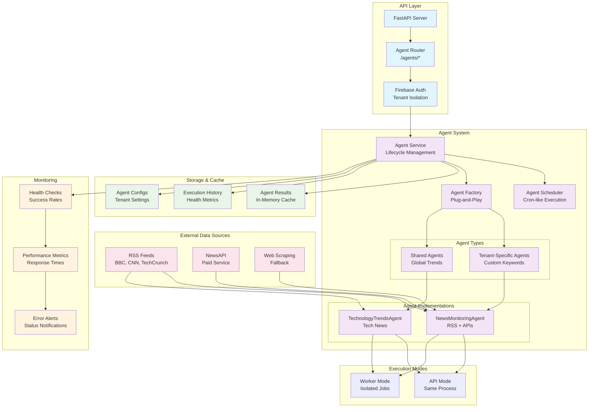
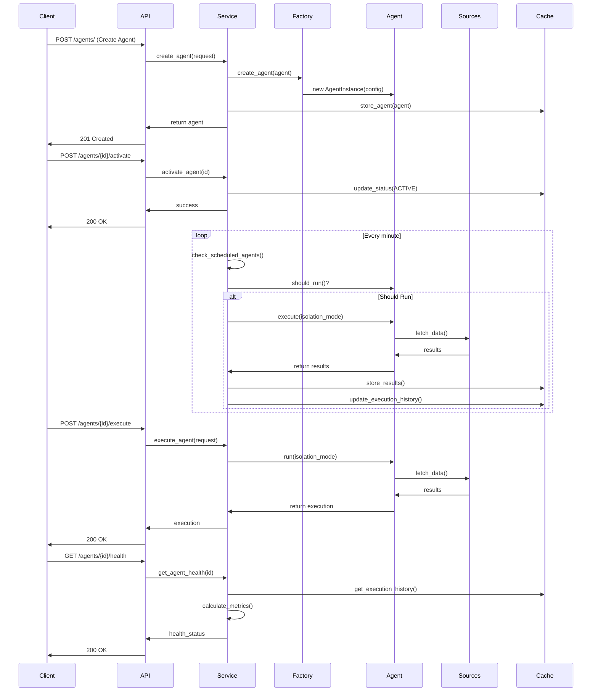
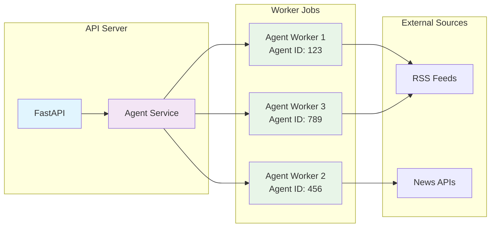

# AI Agent Architecture Diagrams

## Mermaid Architecture Diagram



## Agent Lifecycle Flow



## Isolation Mode Architecture



## ASCII Art Architecture

```
┌─────────────────────────────────────────────────────────────────────────────┐
│                           LIVING TWIN AI AGENT SYSTEM                      │
└─────────────────────────────────────────────────────────────────────────────┘

┌─────────────────┐    ┌─────────────────┐    ┌─────────────────┐
│   External      │    │   External      │    │   External      │
│   Data Sources  │    │   Data Sources  │    │   Data Sources  │
├─────────────────┤    ├─────────────────┤    ├─────────────────┤
│ • BBC RSS       │    │ • NewsAPI       │    │ • Web Scraping  │
│ • CNN RSS       │    │ • Paid Service  │    │ • Fallback      │
│ • TechCrunch    │    │ • Enhanced      │    │ • Demo Data     │
│ • Reuters       │    │   Results       │    │ • Testing       │
│ • Wired         │    │                 │    │                 │
└─────────────────┘    └─────────────────┘    └─────────────────┘
         │                       │                       │
         └───────────────────────┼───────────────────────┘
                                 │
                    ┌─────────────────────────────────────┐
                    │           API LAYER                 │
                    ├─────────────────────────────────────┤
                    │  ┌─────────────────────────────────┐ │
                    │  │      FastAPI Server             │ │
                    │  │  ┌─────────────────────────────┐ │ │
                    │  │  │    Agent Router             │ │ │
                    │  │  │  • POST /agents/            │ │ │
                    │  │  │  • GET /agents/             │ │ │
                    │  │  │  • POST /agents/{id}/execute│ │ │
                    │  │  │  • GET /agents/{id}/health  │ │ │
                    │  │  └─────────────────────────────┘ │ │
                    │  │  ┌─────────────────────────────┐ │ │
                    │  │  │    Firebase Auth            │ │ │
                    │  │  │  • Tenant Isolation         │ │ │
                    │  │  │  • User Authentication      │ │ │
                    │  │  └─────────────────────────────┘ │ │
                    │  └─────────────────────────────────┘ │
                    └─────────────────────────────────────┘
                                 │
                    ┌─────────────────────────────────────┐
                    │         AGENT SYSTEM                │
                    ├─────────────────────────────────────┤
                    │  ┌─────────────────────────────────┐ │
                    │  │      Agent Service              │ │
                    │  │  • Lifecycle Management         │ │
                    │  │  • Scheduling                   │ │
                    │  │  • Health Monitoring            │ │
                    │  │  • Result Caching               │ │
                    │  └─────────────────────────────────┘ │
                    │  ┌─────────────────────────────────┐ │
                    │  │      Agent Factory              │ │
                    │  │  • Plug-and-Play Creation       │ │
                    │  │  • Capability Mapping           │ │
                    │  │  • Configuration Validation     │ │
                    │  └─────────────────────────────────┘ │
                    │                                     │
                    │  ┌─────────────────────────────────┐ │
                    │  │        Agent Types              │ │
                    │  │  ┌─────────────────────────────┐ │ │
                    │  │  │   Tenant-Specific Agents    │ │ │
                    │  │  │  • Custom Keywords (5 max)  │ │ │
                    │  │  │  • Competitor Monitoring    │ │ │
                    │  │  │  • Industry Tracking        │ │ │
                    │  │  └─────────────────────────────┘ │ │
                    │  │  ┌─────────────────────────────┐ │ │
                    │  │  │      Shared Agents          │ │ │
                    │  │  │  • Global Tech Trends       │ │ │
                    │  │  │  • AI/ML Developments       │ │ │
                    │  │  │  • Cloud Computing News     │ │ │
                    │  │  └─────────────────────────────┘ │ │
                    │  └─────────────────────────────────┘ │
                    │                                     │
                    │  ┌─────────────────────────────────┐ │
                    │  │    Agent Implementations       │ │
                    │  │  ┌─────────────────────────────┐ │ │
                    │  │  │   NewsMonitoringAgent       │ │ │
                    │  │  │  • RSS Feed Processing      │ │ │
                    │  │  │  • NewsAPI Integration      │ │ │
                    │  │  │  • Keyword Matching         │ │ │
                    │  │  └─────────────────────────────┘ │ │
                    │  │  ┌─────────────────────────────┐ │ │
                    │  │  │  TechnologyTrendsAgent      │ │ │
                    │  │  │  • Tech News Aggregation    │ │ │
                    │  │  │  • Trend Analysis           │ │ │
                    │  │  │  • Global Intelligence      │ │ │
                    │  │  └─────────────────────────────┘ │ │
                    │  └─────────────────────────────────┘ │
                    └─────────────────────────────────────┘
                                 │
                    ┌─────────────────────────────────────┐
                    │       EXECUTION MODES               │
                    ├─────────────────────────────────────┤
                    │  ┌─────────────────────────────────┐ │
                    │  │         API Mode                │ │
                    │  │  • Same Process Execution       │ │
                    │  │  • Shared Resources             │ │
                    │  │  • Faster Response              │ │
                    │  │  • Less Isolation               │ │
                    │  └─────────────────────────────────┘ │
                    │  ┌─────────────────────────────────┐ │
                    │  │       Worker Mode               │ │
                    │  │  • Isolated Cloud Run Jobs      │ │
                    │  │  • Separate Memory/CPU          │ │
                    │  │  • Error Containment            │ │
                    │  │  • Independent Scaling          │ │
                    │  └─────────────────────────────────┘ │
                    └─────────────────────────────────────┘
                                 │
                    ┌─────────────────────────────────────┐
                    │      STORAGE & CACHE                │
                    ├─────────────────────────────────────┤
                    │  ┌─────────────────────────────────┐ │
                    │  │      Agent Results              │ │
                    │  │  • In-Memory Cache              │ │
                    │  │  • Configurable Retention       │ │
                    │  │  • Query Optimization           │ │
                    │  └─────────────────────────────────┘ │
                    │  ┌─────────────────────────────────┐ │
                    │  │    Execution History            │ │
                    │  │  • Success/Failure Tracking     │ │
                    │  │  • Performance Metrics          │ │
                    │  │  • Health Indicators            │ │
                    │  └─────────────────────────────────┘ │
                    │  ┌─────────────────────────────────┐ │
                    │  │     Agent Configurations        │ │
                    │  │  • Tenant Settings              │ │
                    │  │  • Keyword Lists                │ │
                    │  │  • Update Frequencies           │ │
                    │  └─────────────────────────────────┘ │
                    └─────────────────────────────────────┘
                                 │
                    ┌─────────────────────────────────────┐
                    │         MONITORING                  │
                    ├─────────────────────────────────────┤
                    │  ┌─────────────────────────────────┐ │
                    │  │       Health Checks             │ │
                    │  │  • Success Rate (7-day)         │ │
                    │  │  • Error Count Tracking         │ │
                    │  │  • Execution Time Monitoring    │ │
                    │  │  • Status Indicators            │ │
                    │  └─────────────────────────────────┘ │
                    │  ┌─────────────────────────────────┐ │
                    │  │     Performance Metrics         │ │
                    │  │  • Response Times               │ │
                    │  │  • Resource Utilization         │ │
                    │  │  • Throughput Monitoring        │ │
                    │  │  • Queue Lengths                │ │
                    │  └─────────────────────────────────┘ │
                    │  ┌─────────────────────────────────┐ │
                    │  │        Error Alerts             │ │
                    │  │  • Health Degradation           │ │
                    │  │  • High Error Rates             │ │
                    │  │  • Execution Timeouts           │ │
                    │  │  • Resource Exhaustion          │ │
                    │  └─────────────────────────────────┘ │
                    └─────────────────────────────────────┘

┌─────────────────────────────────────────────────────────────────────────────┐
│                              KEY FEATURES                                  │
├─────────────────────────────────────────────────────────────────────────────┤
│ 🔌 Plug-and-Play Architecture  │  🔒 Tenant Isolation & Security          │
│ 🚀 Configurable & Extensible   │  📊 Health Monitoring & Metrics          │
│ 🛡️  Isolation Mode Support     │  ⚡ Scheduled & Manual Execution         │
│ 📰 Free News Sources Built-in  │  🎯 Custom Keyword Monitoring (5 max)     │
│ 🔄 Shared & Tenant Agents      │  📈 Scalable Cloud Run Deployment        │
└─────────────────────────────────────────────────────────────────────────────┘
```

## Agent Data Flow

```
┌─────────────┐    ┌─────────────┐    ┌─────────────┐    ┌─────────────┐
│   Client    │    │    API      │    │   Agent     │    │   Sources   │
│  Request    │───▶│   Router    │───▶│  Service    │───▶│   (RSS/API) │
└─────────────┘    └─────────────┘    └─────────────┘    └─────────────┘
       │                   │                   │                   │
       │                   │                   │                   │
       │              ┌─────────────┐    ┌─────────────┐    ┌─────────────┐
       │              │   Agent     │    │   Agent     │    │   Results   │
       │              │  Factory    │───▶│ Instance    │◀───│  Processing │
       │              └─────────────┘    └─────────────┘    └─────────────┘
       │                   │                   │                   │
       │                   │                   │                   │
       │              ┌─────────────┐    ┌─────────────┐    ┌─────────────┐
       │              │   Config    │    │  Execution  │    │   Cache     │
       │              │ Validation  │    │  History    │    │  Storage    │
       │              └─────────────┘    └─────────────┘    └─────────────┘
       │                   │                   │                   │
       │                   │                   │                   │
       │              ┌─────────────┐    ┌─────────────┐    ┌─────────────┐
       │              │   Health    │    │  Metrics    │    │   Alerts    │
       │              │  Monitoring │───▶│ Collection  │───▶│ Generation  │
       │              └─────────────┘    └─────────────┘    └─────────────┘
       │                   │                   │                   │
       ▼                   ▼                   ▼                   ▼
┌─────────────┐    ┌─────────────┐    ┌─────────────┐    ┌─────────────┐
│   Response  │    │   Status    │    │  Results    │    │  Monitoring │
│  (JSON)     │    │  Updates    │    │  Cache      │    │  Dashboard  │
└─────────────┘    └─────────────┘    └─────────────┘    └─────────────┘
```

## Isolation Mode Comparison

```
┌─────────────────────────────────────────────────────────────────────────────┐
│                        EXECUTION MODE COMPARISON                           │
└─────────────────────────────────────────────────────────────────────────────┘

┌─────────────────────────────────────────────────────────────────────────────┐
│                              API MODE                                      │
├─────────────────────────────────────────────────────────────────────────────┤
│                                                                             │
│  ┌─────────────────┐    ┌─────────────────┐    ┌─────────────────┐         │
│  │   FastAPI       │    │   Agent         │    │   Agent         │         │
│  │   Server        │    │   Service       │    │   Instances     │         │
│  │                 │    │                 │    │                 │         │
│  │  ┌─────────────┐│    │  ┌─────────────┐│    │  ┌─────────────┐│         │
│  │  │   Router    ││    │  │ Scheduler   ││    │  │ Agent 1     ││         │
│  │  └─────────────┘│    │  └─────────────┘│    │  └─────────────┘│         │
│  │  ┌─────────────┐│    │  ┌─────────────┐│    │  ┌─────────────┐│         │
│  │  │   Auth      ││    │  │ Factory     ││    │  │ Agent 2     ││         │
│  │  └─────────────┘│    │  └─────────────┘│    │  └─────────────┘│         │
│  └─────────────────┘    └─────────────────┘    └─────────────────┘         │
│                                                                             │
│  ✅ Faster Response Times                                                   │
│  ✅ Shared Resources                                                        │
│  ✅ Simpler Deployment                                                      │
│  ❌ Less Isolation                                                          │
│  ❌ Resource Contention                                                     │
│  ❌ Error Propagation Risk                                                  │
│                                                                             │
└─────────────────────────────────────────────────────────────────────────────┘

┌─────────────────────────────────────────────────────────────────────────────┐
│                            WORKER MODE                                     │
├─────────────────────────────────────────────────────────────────────────────┘
│                                                                             │
│  ┌─────────────────┐    ┌─────────────────┐    ┌─────────────────┐         │
│  │   FastAPI       │    │   Cloud Run     │    │   Cloud Run     │         │
│  │   Server        │    │   Job 1         │    │   Job 2         │         │
│  │                 │    │                 │    │                 │         │
│  │  ┌─────────────┐│    │  ┌─────────────┐│    │  ┌─────────────┐│         │
│  │  │   Router    ││    │  │ Agent       ││    │  │ Agent       ││         │
│  │  └─────────────┘│    │  │ Worker 1    ││    │  │ Worker 2    ││         │
│  │  ┌─────────────┐│    │  └─────────────┘│    │  └─────────────┘│         │
│  │  │   Auth      ││    │  ┌─────────────┐│    │  ┌─────────────┐│         │
│  │  └─────────────┘│    │  │ Agent       ││    │  │ Agent       ││         │
│  └─────────────────┘    │  │ Instance 1  ││    │  │ Instance 2  ││         │
│                         │  └─────────────┘│    │  └─────────────┘│         │
│                         └─────────────────┘    └─────────────────┘         │
│                                                                             │
│  ✅ Complete Isolation                                                      │
│  ✅ Independent Scaling                                                     │
│  ✅ Error Containment                                                       │
│  ✅ Resource Dedication                                                     │
│  ❌ Higher Latency                                                          │
│  ❌ More Complex Deployment                                                 │
│  ❌ Higher Resource Usage                                                   │
│                                                                             │
└─────────────────────────────────────────────────────────────────────────────┘
```
