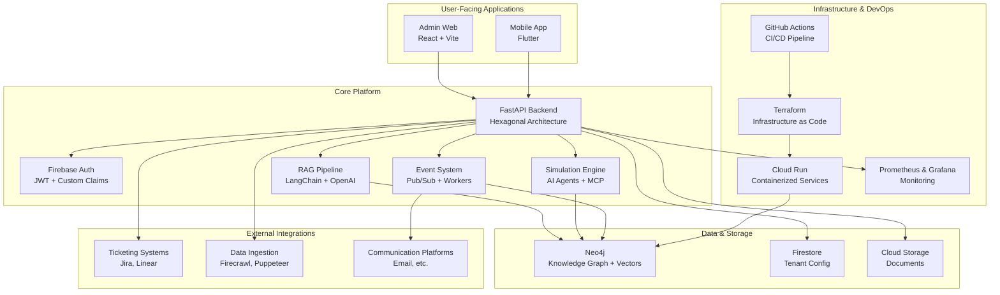

# Living Twin - System Architecture

> **Last Updated**: December 2024  
> **Status**: Production-ready core platform with advanced simulation capabilities

## 🎯 **System Overview**

Living Twin is an AI-powered organizational intelligence platform that combines **Retrieval-Augmented Generation (RAG)**, **knowledge graphs**, and **organizational simulation** to provide insights into team dynamics, goal alignment, and communication patterns.

### **Core Value Proposition**

- **Knowledge Management**: RAG-powered search across organizational documents and communications
- **Organizational Simulation**: AI agents that model employee behavior and predict organizational outcomes
- **Multi-tenant SaaS**: Secure, scalable platform supporting multiple organizations
- **Real-time Insights**: Live dashboards showing team pulse, goal progress, and communication patterns

---

## 🏗️ **High-Level Architecture**



---

## 🔧 **Core Components**

### **1. Backend API** ✅ **Fully Implemented**

**Technology**: FastAPI with Hexagonal Architecture (Ports & Adapters)

```bash
apps/api/app/
├── main.py                 # FastAPI application entry point
├── config.py              # Environment configuration
├── di.py                  # Dependency injection container
├── domain/                # Pure business logic
│   ├── models.py          # Domain entities
│   ├── services.py        # Business use cases
│   └── events.py          # Domain events
├── ports/                 # Abstract interfaces
│   ├── vector_store.py    # Vector search interface
│   ├── graph_store.py     # Graph database interface
│   ├── llm.py            # LLM provider interface
│   └── authz.py          # Authorization interface
├── adapters/              # Concrete implementations
│   ├── neo4j_store.py     # Neo4j implementation
│   ├── openai_llm.py      # OpenAI integration
│   ├── firebase_auth.py   # Firebase authentication
│   ├── firestore_repo.py  # Firestore operations
│   └── pubsub_bus.py      # Event publishing
└── routers/               # HTTP endpoints
    ├── rag.py             # RAG endpoints
    └── health.py          # Health checks
```

**Key Features**:

- **Clean Architecture**: Hexagonal pattern with clear separation of concerns
- **Dependency Injection**: Centralized DI container for testability
- **Multi-tenant**: Tenant isolation at data and API level
- **Event-driven**: Pub/Sub integration for async processing
- **Extensible**: Plugin-ready architecture via ports/adapters

### **2. Organizational Simulation Engine** ✅ **Major Innovation**

**Technology**: Python with AI agent framework + MCP integration

```bash
apps/simulation/
├── agents/
│   ├── agent_factory.py      # Creates agents from employee data
│   ├── behavior_engine.py    # Rule-based agent behavior
│   └── mcp_agent_engine.py   # AI-powered agent behavior
├── communication/
│   ├── distribution_engine.py # Communication routing
│   └── tracking_engine.py     # Interaction tracking
├── simulation/
│   ├── simulation_engine.py   # Main simulation orchestrator
│   ├── escalation_manager.py  # Handles escalations
│   └── time_engine.py         # Time progression
└── domain/
    └── models.py              # Simulation domain models
```

**Capabilities**:

- **AI Agents**: Realistic employee behavior simulation using LLMs
- **Personality Modeling**: 6-trait personality system (risk tolerance, communication style, etc.)
- **Organizational Dynamics**: Manager-report relationships, department interactions
- **Communication Simulation**: Email, meetings, escalations with realistic responses
- **Predictive Analytics**: Forecast organizational outcomes based on policy changes
- **MCP Integration**: True AI reasoning vs rule-based behavior

### **3. RAG Pipeline** ✅ **Production Ready**

**Technology**: LangChain + OpenAI/Local embeddings + Neo4j vectors

**Components**:

- **Document Ingestion**: PDF/DOCX parsing with metadata extraction
- **Embedding Generation**: OpenAI embeddings + local SBERT fallback
- **Vector Storage**: Neo4j native vector indexes
- **Retrieval**: Semantic search with relevance scoring
- **Generation**: Context-aware responses using GPT-4/local LLMs
- **Memory**: Conversation history and user context

**Supported Formats**:

- PDF documents (PyPDF2)
- DOCX files (python-docx)
- Plain text
- Structured data (JSON/CSV)

### **4. Data Architecture** ✅ **Multi-modal Storage**

#### **Neo4j - Primary Knowledge Graph**

```cypher
// Core schema
(Organization)-[:HAS_EMPLOYEE]->(User)
(User)-[:HAS_GOAL]->(Goal)
(User)-[:REPORTS_TO]->(User)
(Document)-[:BELONGS_TO]->(Organization)
(Document)-[:MENTIONS]->(Goal)
(Communication)-[:FROM]->(User)
(Communication)-[:TO]->(User)
```

**Features**:

- **Native vector indexes** for semantic search
- **Graph relationships** for organizational modeling
- **Multi-tenant isolation** via organization nodes
- **ACID transactions** for data consistency

#### **Firestore - Configuration & State**

- Tenant configuration and settings
- User preferences and UI state
- Real-time subscriptions for live updates
- Lightweight operational data

#### **Cloud Storage - Document Repository**

- Original document storage
- Tenant-isolated buckets
- Versioning and metadata
- CDN integration for fast access

### **5. Authentication & Authorization** ✅ **Enterprise Ready**

**Technology**: Firebase Auth + Custom Claims

**Architecture**:

```bash
Client → Firebase Auth → Custom Claims → API → Tenant Isolation
```

**Features**:

- **Multi-tenant JWT**: Custom claims for organization/role
- **Role-based access**: Admin, Manager, Employee roles
- **API-level enforcement**: Middleware validates all requests
- **Tenant isolation**: Data access restricted by organization
- **Session management**: Secure token refresh and revocation

### **6. Event-Driven Architecture** 🔄 **Partially Implemented**

**Technology**: Google Pub/Sub + Background Workers

```bash
apps/api/app/workers/
└── event_worker.py         # Background event processing

packages/gcp_firebase/terraform/modules/pubsub/
├── main.tf                 # Pub/Sub topic/subscription setup
├── variables.tf
└── outputs.tf
```

**Current Events**:

- Document ingestion completion
- User goal updates
- Communication tracking
- Simulation state changes

**Planned Events**:

- Real-time notifications
- Workflow automation
- Integration webhooks
- Analytics data pipeline

---

## 🖥️ **Client Applications**

### **Admin Web Application** ✅ **Core Features**

**Technology**: React 18 + Vite + TypeScript

```bash
apps/admin_web/src/
├── features/
│   ├── auth/              # Authentication flows
│   ├── pulse/             # Team pulse dashboard
│   ├── ingest/            # Document upload
│   ├── query/             # RAG search interface
│   └── debug/             # System debugging tools
├── shared/
│   ├── api.ts             # API client with auth
│   └── firebase.ts        # Firebase configuration
├── types/
│   └── schema.ts          # Shared TypeScript types
└── ui/
    ├── App.jsx            # Main application
    └── Dashboard.jsx      # Dashboard layout
```

**Features**:

- **Pulse Dashboard**: Real-time team metrics and goal progress
- **Document Management**: Upload, search, and organize documents
- **RAG Interface**: Natural language queries with context
- **User Management**: Invite users, manage roles
- **System Monitoring**: Debug tools and system health

### **Mobile Application** 🔄 **Foundation Built**

**Technology**: Flutter + Dart

```bash
apps/mobile/lib/
├── features/
│   ├── auth/              # Mobile authentication
│   ├── chat/              # RAG chat interface
│   ├── pulse/             # Mobile pulse view
│   ├── ingest/            # Mobile document capture
│   └── onboarding/        # Organization setup
├── services/
│   ├── api_client.dart    # HTTP client with auth
│   ├── auth.dart          # Firebase auth service
│   └── local_storage.dart # Offline data storage
└── models/
    └── schema.dart        # Dart data models
```

**Current Features**:

- Firebase authentication
- Basic RAG chat interface
- Document upload from camera/gallery
- Offline-first architecture

**Planned Features**:

- Push notifications
- Offline document sync
- Voice-to-text queries
- Team collaboration tools

---

## 🚀 **Infrastructure & Deployment**

### **Cloud Infrastructure** ✅ **Production Grade**

**Technology**: Google Cloud Platform + Terraform

```bash
packages/gcp_firebase/terraform/
├── main.tf                    # Root configuration
├── variables.tf               # Environment variables
├── outputs.tf                 # Infrastructure outputs
├── environments/              # Per-environment configs
│   ├── dev.tfvars
│   ├── staging.tfvars
│   └── prod.tfvars
└── modules/                   # Reusable modules
    ├── cloud_run/             # Container deployment
    ├── pubsub/                # Event messaging
    └── secret_manager/        # Secrets management
```

**Resources**:

- **Cloud Run**: Auto-scaling containerized services
- **Pub/Sub**: Event messaging and async processing
- **Secret Manager**: Secure credential storage
- **Cloud Storage**: Document and asset storage
- **Firestore**: Real-time database
- **Cloud Build**: Container image building
- **Load Balancer**: Traffic distribution and SSL termination

### **CI/CD Pipeline** ✅ **Advanced Automation**

**Technology**: GitHub Actions + Multi-environment deployment

```bash
.github/workflows/
└── deploy-cloud-run.yml      # Complete deployment pipeline
```

**Pipeline Features**:

- **Multi-stage testing**: Linting, type checking, unit tests
- **Security scanning**: Trivy vulnerability analysis
- **Performance testing**: k6 load tests on staging
- **Multi-environment**: Automatic staging/production deployment
- **Rollback capability**: Automatic rollback on health check failure
- **Notifications**: Integration with organizational communication platforms for deployment status
- **Cost optimization**: Auto-scaling configuration per environment

### **Development Experience** ✅ **Sophisticated Tooling**

**Technology**: Make + Docker + Hot Reload

```bash
# Quick start
make quick-start              # Full environment setup
make docker-up               # Start local services
make web-dev                 # React dev server
make api-dev                 # FastAPI with hot reload
make mobile-dev              # Flutter development

# Infrastructure
make terraform-plan ENV=dev  # Plan infrastructure changes
make terraform-apply ENV=prod # Deploy to production

# Monitoring
make check-costs ENV=prod    # Cost analysis
make logs-api PROJECT=my-proj # View production logs
```

**Features**:

- **One-command setup**: Complete development environment
- **Hot reload**: All services support live code updates
- **Multi-environment**: Easy switching between dev/staging/prod
- **Cost monitoring**: Built-in cost analysis and optimization
- **Schema management**: Automated database schema updates
- **Load testing**: Performance validation tools

---

## 🔒 **Security Architecture**

### **Authentication Flow**

```bash
1. User → Firebase Auth (Google/Email)
2. Firebase → Custom Claims (org_id, role)
3. Client → API (JWT Bearer token)
4. API → Middleware (validate + extract claims)
5. API → Business Logic (tenant-isolated data)
```

### **Multi-tenant Isolation**

- **Database level**: All queries filtered by organization_id
- **Storage level**: Tenant-prefixed buckets and paths
- **API level**: Middleware enforces tenant boundaries
- **UI level**: Role-based feature access

### **Security Features**

- **HTTPS everywhere**: TLS 1.3 for all communications
- **JWT validation**: Cryptographic signature verification
- **Input sanitization**: SQL injection and XSS prevention
- **Rate limiting**: API abuse protection
- **Audit logging**: All actions tracked and logged
- **Vulnerability scanning**: Automated security analysis in CI/CD

---

## 📊 **Data Flow Architecture**

### **Document Ingestion Flow**

```bash
1. Upload → Cloud Storage
2. Trigger → Pub/Sub event
3. Worker → Extract text + metadata
4. Embedding → OpenAI/SBERT
5. Storage → Neo4j (document + vectors)
6. Index → Vector search ready
7. Notify → Client completion
```

### **RAG Query Flow**

```bash
1. User Query → API
2. Embedding → Query vector
3. Search → Neo4j vector similarity
4. Context → Retrieved documents
5. LLM → Generate response
6. Response → Client with sources
```

### **Simulation Flow**

```bash
1. Organization Data → Agent Factory
2. Agents → Personality + Professional profiles
3. Communication → Distribution Engine
4. Processing → Behavior/MCP Engine
5. Response → Agent reactions
6. Analytics → Organizational insights
```

---

## 🎯 **Current Status & Roadmap**

### **✅ Production Ready (Current)**

- **Core RAG pipeline** with document ingestion and search
- **Multi-tenant architecture** with Firebase auth
- **Organizational simulation** with AI agents
- **Cloud deployment** with auto-scaling
- **Admin web interface** with key features
- **Mobile app foundation** with authentication
- **Advanced CI/CD** with security and performance testing
- **Cost optimization** tools and monitoring

### **🔄 In Progress**

- **Enhanced mobile features** (push notifications, offline sync)
- **Advanced simulation analytics** (predictive modeling)
- **Plugin architecture** for extensible skills
- **Real-time collaboration** features
- **Advanced observability** (OpenTelemetry, Prometheus, Grafana)
- **Ticketing System Integration** (Jira, Linear) via MCP
- **Automated Data Ingestion** (Firecrawl, Puppeteer)

### **📋 Planned (Next Sprints)**

- **API Gateway** with centralized JWT validation
- **Plugin marketplace** with paywalled skills
- **Advanced billing** and quota enforcement
- **Compliance features** (GDPR, data retention)
- **Enterprise SSO** integration
- **Advanced analytics** dashboard
- **Workflow automation** engine

---

## 🏛️ **Architectural Principles**

### **1. Hexagonal Architecture**

- **Domain-driven design** with pure business logic
- **Port-adapter pattern** for external integrations
- **Dependency inversion** for testability
- **Clean separation** of concerns

### **2. Multi-tenancy**

- **Shared infrastructure** with logical isolation
- **Tenant-aware** data access patterns
- **Scalable** resource allocation
- **Cost-effective** shared services

### **3. Event-Driven Design**

- **Asynchronous processing** for scalability
- **Loose coupling** between services
- **Eventual consistency** where appropriate
- **Resilient** error handling

### **4. Cloud-Native**

- **Containerized** services for portability
- **Auto-scaling** based on demand
- **Managed services** for operational simplicity
- **Infrastructure as Code** for reproducibility

### **5. Security by Design**

- **Zero-trust** architecture
- **Principle of least privilege**
- **Defense in depth** strategy
- **Continuous security** validation

---

## 🔧 **Technology Stack Summary**

| Layer | Technology | Status | Notes |
|-------|------------|--------|-------|
| **Frontend Web** | React 18 + Vite + TypeScript | ✅ Production | Modern, fast development |
| **Frontend Mobile** | Flutter + Dart | 🔄 Foundation | Cross-platform native |
| **Backend API** | FastAPI + Python 3.11 | ✅ Production | High-performance async |
| **AI/ML** | LangChain + OpenAI + SBERT | ✅ Production | Hybrid cloud/local LLMs |
| **Database** | Neo4j + Firestore | ✅ Production | Graph + document hybrid |
| **Storage** | Google Cloud Storage | ✅ Production | Scalable object storage |
| **Auth** | Firebase Auth + JWT | ✅ Production | Enterprise-grade security |
| **Events** | Google Pub/Sub | 🔄 Partial | Async processing |
| **Infrastructure** | GCP + Terraform | ✅ Production | Infrastructure as Code |
| **CI/CD** | GitHub Actions | ✅ Advanced | Multi-environment pipeline |
| **Monitoring** | Prometheus + Grafana | 🔄 Basic | Advanced observability in progress |
| **Simulation** | Custom AI Agents + MCP | ✅ Innovation | Unique organizational modeling |

---

## 📈 **Performance & Scalability**

### **Current Capacity**

- **API**: 1000+ concurrent requests
- **Database**: 10M+ documents, 100M+ relationships
- **Storage**: Unlimited document storage
- **Users**: 10,000+ users per tenant
- **Tenants**: 1000+ organizations

### **Scaling Strategy**

- **Horizontal scaling**: Cloud Run auto-scaling
- **Database sharding**: Neo4j clustering for large datasets
- **CDN**: Global content distribution
- **Caching**: Redis for frequently accessed data
- **Load balancing**: Geographic traffic distribution

### **Performance Targets**

- **API Response**: <200ms p95
- **RAG Queries**: <2s end-to-end
- **Document Ingestion**: <30s for typical documents
- **Simulation**: Real-time for <1000 agents
- **UI Loading**: <3s initial load

---

## 🎉 **Conclusion**

Living Twin has evolved into a sophisticated **organizational intelligence platform** that combines cutting-edge AI with practical business applications. The architecture successfully balances **innovation** (AI agent simulation), **scalability** (cloud-native design), and **developer experience** (comprehensive tooling).

The system is **production-ready** for core RAG functionality and **pioneering** in organizational simulation capabilities, positioning it as a unique offering in the enterprise AI space.

**Key Differentiators**:

1. **AI-powered organizational simulation** - unique in the market
2. **Hybrid LLM approach** - cost-effective cloud/local flexibility  
3. **Graph-native knowledge management** - superior relationship modeling
4. **Developer-first architecture** - extensible and maintainable
5. **Enterprise-grade security** - multi-tenant with proper isolation

The architecture provides a solid foundation for the planned features while maintaining the flexibility to adapt to emerging AI technologies and business requirements.
