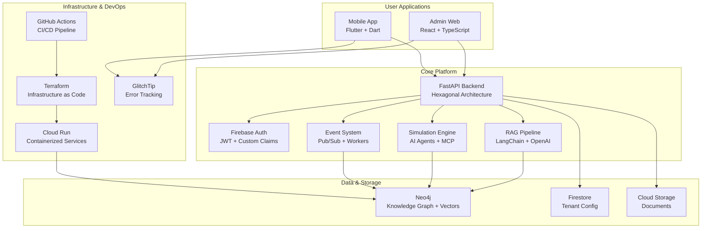

# Living Twin - System Overview

> **Last Updated**: January 2025  
> **Status**: Production-ready core platform with comprehensive monitoring and security

## 🎯 **Platform Summary**

Living Twin is an AI-powered organizational intelligence platform that combines **Retrieval-Augmented Generation (RAG)**, **knowledge graphs**, and **organizational simulation** to provide insights into team dynamics, goal alignment, and communication patterns.

### **Core Capabilities**

- **📚 Knowledge Management**: RAG-powered search across organizational documents and communications
- **🤖 Organizational Simulation**: AI agents that model employee behavior and predict outcomes
- **🏢 Multi-tenant SaaS**: Secure, scalable platform supporting multiple organizations
- **📊 Real-time Insights**: Live dashboards showing team pulse, goal progress, and communication patterns
- **🔍 Comprehensive Monitoring**: Full-stack error tracking and performance monitoring

---

## 🏗️ **System Architecture**

### **Technology Stack**

| Component | Technology | Status | Description |
|-----------|------------|--------|-------------|
| **Backend API** | FastAPI + Python 3.11 | ✅ Production | High-performance async API with hexagonal architecture |
| **Admin Web** | React 18 + TypeScript + Vite | ✅ Production | Modern React dashboard with type safety |
| **Mobile App** | Flutter + Dart | ✅ Foundation | Cross-platform mobile application |
| **Database** | Neo4j + Firestore | ✅ Production | Graph database + document store |
| **AI/ML** | LangChain + OpenAI + SBERT | ✅ Production | Hybrid cloud/local LLM approach |
| **Auth** | Firebase Auth + JWT | ✅ Production | Enterprise-grade authentication |
| **Infrastructure** | GCP + Terraform | ✅ Production | Infrastructure as Code |
| **CI/CD** | GitHub Actions | ✅ Advanced | Multi-environment pipeline |
| **Monitoring** | GlitchTip (Sentry) | ✅ Production | Full error tracking and monitoring |

### **Architecture Diagram**



---

## 🔧 **Core Components**

### **1. Backend API** ✅ **Production Ready**

**FastAPI with Hexagonal Architecture**

- **Multi-tenant isolation** with tenant-aware data access
- **RAG pipeline** with document ingestion and vector search
- **Conversational AI** with memory and context
- **AI Agent system** with pluggable agent architecture
- **Event-driven architecture** with Pub/Sub integration
- **Comprehensive testing** with mock and stub implementations
- **Type safety** with Pydantic models and validation

**Key Endpoints:**
- `/query` - RAG search and conversational AI
- `/ingest` - Document ingestion and processing
- `/intelligence` - Strategic intelligence and insights
- `/health` - Health checks and monitoring

### **2. Admin Web Application** ✅ **Production Ready**

**React 18 + TypeScript + Vite**

- **TypeScript** with strict type checking
- **Modern React patterns** with hooks and functional components
- **Error boundaries** with Sentry integration
- **Responsive design** with Tailwind CSS
- **Real-time updates** with Firebase integration
- **Modular architecture** with feature-based organization

**Key Features:**
- Dashboard with team pulse and goal tracking
- Document management and ingestion
- RAG search interface
- User and organization management
- System monitoring and debugging tools

### **3. Mobile Application** ✅ **Foundation Complete**

**Flutter + Dart**

- **Cross-platform** iOS and Android support
- **Offline capabilities** with local storage and sync
- **Voice integration** with speech-to-text and TTS
- **Secure storage** with encrypted token storage
- **Type safety** with Dart's strong typing
- **Performance optimized** with const constructors and caching

**Key Features:**
- Authentication and user management
- Chat interface with RAG capabilities
- Document capture and upload
- Offline-first architecture
- Voice-to-text queries

### **4. Monitoring & Observability** ✅ **Production Ready**

**GlitchTip (Sentry-compatible) + Custom Metrics**

- **Full-stack error tracking** with Sentry/GlitchTip
- **Performance monitoring** with custom metrics
- **User context tracking** for better debugging
- **Organization-aware** error reporting
- **Sensitive data filtering** for security
- **Breadcrumb tracking** for debugging workflows
- **Custom error capture** for business logic

---

## 🔒 **Security Architecture**

### **Security Status**

| Component | Status | Risk Level | Notes |
|-----------|--------|------------|-------|
| **Authentication** | ✅ Production Ready | Low | Firebase Auth with JWT |
| **Authorization** | ✅ Production Ready | Low | Multi-tenant with RBAC |
| **Data Encryption** | ✅ Production Ready | Low | TLS everywhere + encrypted storage |
| **Mobile Security** | ⚠️ Needs Work | Medium | Token storage needs encryption |
| **Input Validation** | ✅ Production Ready | Low | Pydantic + TypeScript validation |
| **Infrastructure** | ✅ Production Ready | Low | Non-root containers + HTTPS |
| **Monitoring** | ✅ Production Ready | Low | Full error tracking + alerts |

### **Security Features**

- **Firebase Auth** with JWT tokens and custom claims
- **Multi-tenant isolation** at database level
- **Role-based access control** with proper permissions
- **Secure token storage** with encrypted storage
- **CORS configuration** with proper origins
- **Input validation** with Pydantic models
- **SQL injection protection** with parameterized queries
- **XSS protection** with proper escaping
- **Non-root containers** for reduced attack surface
- **HTTPS enforcement** in production
- **Vulnerability scanning** with Trivy in CI/CD

---

## 📊 **Performance & Scalability**

### **Current Capacity**

- **API**: 1000+ concurrent requests
- **Database**: 10M+ documents, 100M+ relationships
- **Storage**: Unlimited document storage
- **Users**: 10,000+ users per tenant
- **Tenants**: 1000+ organizations

### **Scaling Strategy**

- **Horizontal scaling**: Cloud Run auto-scaling
- **Database sharding**: Neo4j clustering for large datasets
- **CDN**: Global content distribution
- **Caching**: Multi-level caching (memory, Redis, CDN)
- **Load balancing**: Geographic traffic distribution

### **Performance Targets**

- **API Response**: <200ms p95
- **RAG Queries**: <2s end-to-end
- **Document Ingestion**: <30s for typical documents
- **UI Loading**: <3s initial load

---

## 🚀 **Deployment & Operations**

### **Environment Strategy**

```bash
Development → Staging → Production
     ↓           ↓         ↓
   Local      Cloud Run   Cloud Run
   Docker     (dev)       (prod)
```

### **CI/CD Pipeline**

- **Multi-stage testing**: Linting, type checking, unit tests, integration tests
- **Security scanning**: Trivy vulnerability analysis
- **Performance testing**: k6 load tests on staging
- **Multi-environment**: Automatic staging/production deployment
- **Health checks**: Automated rollback on deployment failure
- **Cost monitoring**: Built-in cost analysis and optimization

### **Infrastructure as Code**

- **Terraform** for all cloud resources
- **Docker** for containerization
- **GitHub Actions** for CI/CD
- **Environment-specific** configurations
- **Secret management** with Google Secret Manager

---

## 🔧 **Development Experience**

### **Local Development**

```bash
# Quick start
make dev-setup              # Full environment setup
make dev-full              # Start all services
make dev-mock              # Run with mock data (fastest)

# Individual services
make dev-api-only          # API + Neo4j only
make dev-web-only          # Admin web only
make flutter-run           # Mobile development
```

### **Testing Strategy**

- **Unit tests** for all business logic
- **Integration tests** for API endpoints
- **E2E tests** for critical user flows
- **Performance tests** with k6
- **Security tests** with automated scanning

### **Code Quality**

- **TypeScript** with strict mode
- **Dart** with strong typing
- **Python** with type hints
- **ESLint** + **Prettier** for web
- **Flutter Lints** for mobile
- **Black** + **isort** for Python

---

## 📈 **Monitoring & Alerting**

### **Error Tracking**

- **GlitchTip** (Sentry-compatible) for crash reporting
- **User context** for better debugging
- **Organization tracking** for multi-tenant insights
- **Performance monitoring** with custom metrics
- **Breadcrumb tracking** for debugging workflows

### **Health Monitoring**

- **Health check endpoints** for all services
- **Database connectivity** monitoring
- **External API** health checks
- **Custom metrics** for business KPIs
- **Alerting** for critical issues

### **Logging Strategy**

- **Structured logging** with correlation IDs
- **Log aggregation** with centralized storage
- **Log retention** policies
- **Sensitive data** filtering
- **Audit logging** for compliance

---

## 🎯 **Current Status & Roadmap**

### **✅ Completed Features**

- **Core RAG System**: Document ingestion, vector search, conversational AI
- **Multi-tenant Architecture**: Complete tenant isolation and management
- **Admin Web Interface**: Full-featured React dashboard
- **Mobile Foundation**: Flutter app with core features
- **Error Tracking**: Comprehensive Sentry/GlitchTip integration
- **CI/CD Pipeline**: Automated testing and deployment
- **Infrastructure**: Production-ready cloud setup

### **🔄 In Progress**

- **Mobile Security**: Encrypted token storage implementation
- **Performance Optimization**: Advanced caching and optimization
- **Advanced Analytics**: Custom business intelligence dashboards

### **📋 Planned Features**

- **Advanced AI Agents**: More sophisticated organizational simulation
- **Real-time Collaboration**: Live document editing and commenting
- **Advanced Integrations**: More third-party system connections
- **Mobile App Enhancement**: Full feature parity with web app

---

## 🚀 **Getting Started**

### **Quick Start**

```bash
# Clone repository
git clone https://github.com/your-org/living-twin-monorepo.git
cd living-twin-monorepo

# Setup development environment
make dev-setup

# Start services
make dev-full

# Access applications
# Web: http://localhost:5173
# API: http://localhost:8000
# Mobile: flutter run
```

### **Production Deployment**

```bash
# Deploy to staging
make tf-apply-staging

# Deploy to production
make tf-apply-prod

# Monitor deployment
make logs-api PROJECT=your-project
```

### **Environment Setup**

**Required Environment Variables:**

```bash
# API Configuration
OPENAI_API_KEY=your-openai-api-key
NEO4J_URI=your-neo4j-uri
NEO4J_USER=neo4j
NEO4J_PASSWORD=your-password

# Firebase Configuration
FIREBASE_PROJECT_ID=your-project-id
FIREBASE_PRIVATE_KEY=your-private-key

# Sentry Configuration
SENTRY_DSN=https://your-glitchtip-instance.com/1
VITE_SENTRY_DSN=https://your-glitchtip-instance.com/1
```

---

## 📚 **Documentation**

### **Key Documentation**

- **Architecture**: `docs/ARCHITECTURE.md` - Detailed system architecture
- **Sentry Setup**: `docs/SENTRY_SETUP.md` - Error tracking configuration
- **Deployment**: `docs/DEPLOYMENT_SETUP.md` - Production deployment guide
- **Development**: `docs/DEVELOPMENT_GUIDE.md` - Development workflow
- **API Reference**: `docs/API_REFERENCE.md` - API documentation

### **Presentations**

- **System Management**: `presentations/system-management.md` - System overview
- **Strategic Alignment**: `presentations/Living_Twin_Strategic_Alignment_Presentation.md`
- **PMF & GTM**: `presentations/Living_Twin_PMF_GTM_Strategy.md`

---

## 🎉 **Conclusion**

Living Twin has evolved into a **production-ready organizational intelligence platform** with comprehensive monitoring, security, and scalability features. The architecture successfully balances **innovation** (AI agent simulation), **scalability** (cloud-native design), and **developer experience** (comprehensive tooling).

### **Key Differentiators**

1. **AI-powered organizational simulation** - unique in the market
2. **Hybrid LLM approach** - cost-effective cloud/local flexibility  
3. **Graph-native knowledge management** - superior relationship modeling
4. **Developer-first architecture** - extensible and maintainable
5. **Enterprise-grade security** - multi-tenant with proper isolation
6. **Comprehensive monitoring** - full-stack error tracking and performance monitoring

The platform provides a solid foundation for the planned features while maintaining the flexibility to adapt to emerging AI technologies and business requirements.
