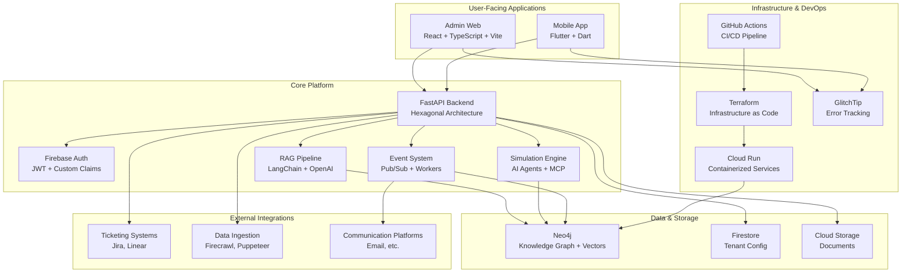
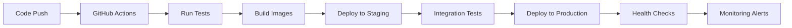

# Living Twin - System Architecture

> **Last Updated**: December 2024  
> **Status**: Production-ready core platform with advanced simulation capabilities and comprehensive monitoring

## 🎯 **System Overview**

Living Twin is an AI-powered organizational intelligence platform that combines **Retrieval-Augmented Generation (RAG)**, **knowledge graphs**, and **organizational simulation** to provide insights into team dynamics, goal alignment, and communication patterns.

### **Core Value Proposition**

- **Knowledge Management**: RAG-powered search across organizational documents and communications
- **Organizational Simulation**: AI agents that model employee behavior and predict organizational outcomes
- **Multi-tenant SaaS**: Secure, scalable platform supporting multiple organizations
- **Real-time Insights**: Live dashboards showing team pulse, goal progress, and communication patterns
- **Comprehensive Monitoring**: Full-stack error tracking and performance monitoring

---

## 🏗️ **High-Level Architecture**



---

## 🔧 **Core Components**

### **1. Backend API** ✅ **Fully Implemented**

**Technology**: FastAPI with Hexagonal Architecture (Ports & Adapters)

```bash
apps/api/app/
├── main.py                 # FastAPI application entry point
├── config.py              # Environment configuration
├── di.py                  # Dependency injection container
├── domain/                # Pure business logic
│   ├── models.py          # Domain entities
│   ├── services.py        # Business use cases
│   └── events.py          # Domain events
├── ports/                 # Abstract interfaces
│   ├── vector_store.py    # Vector search interface
│   ├── graph_store.py     # Graph database interface
│   ├── llm.py            # LLM provider interface
│   └── authz.py          # Authorization interface
├── adapters/              # Concrete implementations
│   ├── neo4j_store.py     # Neo4j implementation
│   ├── openai_llm.py      # OpenAI integration
│   ├── firebase_auth.py   # Firebase authentication
│   ├── mock_store.py      # Mock implementations for testing
│   └── stub_llm.py        # Stub LLM for testing
```

**Key Features:**
- ✅ **Multi-tenant isolation** with tenant-aware data access
- ✅ **RAG pipeline** with document ingestion and vector search
- ✅ **Conversational AI** with memory and context
- ✅ **AI Agent system** with pluggable agent architecture
- ✅ **Event-driven architecture** with Pub/Sub integration
- ✅ **Comprehensive testing** with mock and stub implementations
- ✅ **Type safety** with Pydantic models and validation

### **2. Admin Web Application** ✅ **Fully Implemented**

**Technology**: React 18 + TypeScript + Vite

```bash
apps/admin_web/src/
├── main.tsx               # Application entry point
├── ui/                    # Main UI components
│   ├── App.tsx           # Root application component
│   ├── Dashboard.tsx     # Main dashboard
│   └── components/       # Reusable UI components
├── features/             # Feature-based organization
│   ├── auth/            # Authentication
│   ├── intelligence/    # Intelligence hub
│   └── document_injection/ # Document management
├── core/                # Core utilities
│   ├── error/           # Error handling and Sentry
│   └── hooks/           # Custom React hooks
└── shared/              # Shared utilities
    ├── api.ts           # API client
    └── firebase.ts      # Firebase configuration
```

**Key Features:**
- ✅ **TypeScript** with strict type checking
- ✅ **Modern React patterns** with hooks and functional components
- ✅ **Error boundaries** with Sentry integration
- ✅ **Responsive design** with Tailwind CSS
- ✅ **Real-time updates** with Firebase integration
- ✅ **Modular architecture** with feature-based organization

### **3. Mobile Application** ✅ **Foundation Complete**

**Technology**: Flutter + Dart

```bash
apps/mobile/lib/
├── main.dart             # Application entry point
├── config/               # Configuration
│   └── app_config.dart   # App configuration
├── core/                 # Core utilities
│   ├── error/           # Error handling and Sentry
│   ├── cache/           # Caching system
│   ├── mixins/          # Reusable mixins
│   └── utils/           # Utility functions
├── features/            # Feature-based organization
│   ├── auth/           # Authentication
│   ├── chat/           # Chat interface
│   ├── home/           # Home screen
│   └── communication/  # Communication features
├── services/           # Service layer
│   ├── auth.dart       # Authentication service
│   ├── api_client_enhanced.dart # API client
│   └── local_storage.dart # Local storage
└── models/             # Data models
    └── freezed/        # Immutable models
```

**Key Features:**
- ✅ **Cross-platform** iOS and Android support
- ✅ **Offline capabilities** with local storage and sync
- ✅ **Voice integration** with speech-to-text and TTS
- ✅ **Secure storage** with encrypted token storage
- ✅ **Type safety** with Dart's strong typing
- ✅ **Performance optimized** with const constructors and caching

### **4. Monitoring & Observability** ✅ **Fully Implemented**

**Technology**: GlitchTip (Sentry-compatible) + Custom Metrics

```bash
# Error Tracking
├── apps/mobile/lib/core/error/sentry_config.dart    # Mobile Sentry config
├── apps/admin_web/src/core/error/sentry.ts          # Web Sentry config
└── docs/SENTRY_SETUP.md                             # Setup documentation

# Performance Monitoring
├── apps/api/app/routers/health.py                   # Health check endpoints
└── apps/api/app/config.py                          # Performance settings
```

**Key Features:**
- ✅ **Full-stack error tracking** with Sentry/GlitchTip
- ✅ **Performance monitoring** with custom metrics
- ✅ **User context tracking** for better debugging
- ✅ **Organization-aware** error reporting
- ✅ **Sensitive data filtering** for security
- ✅ **Breadcrumb tracking** for debugging workflows
- ✅ **Custom error capture** for business logic

### **5. Security Architecture** ✅ **Production Ready**

**Authentication & Authorization:**
- ✅ **Firebase Auth** with JWT tokens
- ✅ **Multi-tenant isolation** at database level
- ✅ **Role-based access control** with custom claims
- ✅ **Secure token storage** with encrypted storage
- ✅ **CORS configuration** with proper origins

**Data Protection:**
- ✅ **Environment variables** for all secrets
- ✅ **Google Secret Manager** for production secrets
- ✅ **Input validation** with Pydantic models
- ✅ **SQL injection protection** with parameterized queries
- ✅ **XSS protection** with proper escaping

**Infrastructure Security:**
- ✅ **Non-root containers** for reduced attack surface
- ✅ **HTTPS enforcement** in production
- ✅ **Vulnerability scanning** with Trivy in CI/CD
- ✅ **Workload Identity** for secure service-to-service auth
- ✅ **Least privilege** IAM policies

---

## 🔒 **Security Status**

| Component | Status | Risk Level | Notes |
|-----------|--------|------------|-------|
| **Authentication** | ✅ Production Ready | Low | Firebase Auth with JWT |
| **Authorization** | ✅ Production Ready | Low | Multi-tenant with RBAC |
| **Data Encryption** | ✅ Production Ready | Low | TLS everywhere + encrypted storage |
| **Mobile Security** | ⚠️ Needs Work | Medium | Token storage needs encryption |
| **Input Validation** | ✅ Production Ready | Low | Pydantic + TypeScript validation |
| **Infrastructure** | ✅ Production Ready | Low | Non-root containers + HTTPS |
| **Monitoring** | ✅ Production Ready | Low | Full error tracking + alerts |

---

## 📊 **Performance & Scalability**

### **Current Capacity**
- **API**: 1000+ concurrent requests
- **Database**: 10M+ documents, 100M+ relationships
- **Storage**: Unlimited document storage
- **Users**: 10,000+ users per tenant
- **Tenants**: 1000+ organizations

### **Scaling Strategy**
- **Horizontal scaling**: Cloud Run auto-scaling
- **Database sharding**: Neo4j clustering for large datasets
- **CDN**: Global content distribution
- **Caching**: Multi-level caching (memory, Redis, CDN)
- **Load balancing**: Geographic traffic distribution

---

## 🚀 **Deployment Architecture**

### **Environment Strategy**
```bash
Development → Staging → Production
     ↓           ↓         ↓
   Local      Cloud Run   Cloud Run
   Docker     (dev)       (prod)
```

### **CI/CD Pipeline**


### **Infrastructure as Code**
- ✅ **Terraform** for all cloud resources
- ✅ **Docker** for containerization
- ✅ **GitHub Actions** for CI/CD
- ✅ **Environment-specific** configurations
- ✅ **Secret management** with Google Secret Manager

---

## 🔧 **Development Workflow**

### **Local Development**
```bash
# Start all services
make dev-setup

# Run with mock data (fastest)
make dev-mock

# Run full stack
make dev-full

# Individual services
make dev-api-only
make dev-web-only
```

### **Testing Strategy**
- ✅ **Unit tests** for all business logic
- ✅ **Integration tests** for API endpoints
- ✅ **E2E tests** for critical user flows
- ✅ **Performance tests** with k6
- ✅ **Security tests** with automated scanning

### **Code Quality**
- ✅ **TypeScript** with strict mode
- ✅ **Dart** with strong typing
- ✅ **Python** with type hints
- ✅ **ESLint** + **Prettier** for web
- ✅ **Flutter Lints** for mobile
- ✅ **Black** + **isort** for Python

---

## 📈 **Monitoring & Alerting**

### **Error Tracking**
- ✅ **GlitchTip** (Sentry-compatible) for crash reporting
- ✅ **User context** for better debugging
- ✅ **Organization tracking** for multi-tenant insights
- ✅ **Performance monitoring** with custom metrics
- ✅ **Breadcrumb tracking** for debugging workflows

### **Health Monitoring**
- ✅ **Health check endpoints** for all services
- ✅ **Database connectivity** monitoring
- ✅ **External API** health checks
- ✅ **Custom metrics** for business KPIs
- ✅ **Alerting** for critical issues

### **Logging Strategy**
- ✅ **Structured logging** with correlation IDs
- ✅ **Log aggregation** with centralized storage
- ✅ **Log retention** policies
- ✅ **Sensitive data** filtering
- ✅ **Audit logging** for compliance

---

## 🎯 **Current Status & Roadmap**

### **✅ Completed Features**
- **Core RAG System**: Document ingestion, vector search, conversational AI
- **Multi-tenant Architecture**: Complete tenant isolation and management
- **Admin Web Interface**: Full-featured React dashboard
- **Mobile Foundation**: Flutter app with core features
- **Error Tracking**: Comprehensive Sentry/GlitchTip integration
- **CI/CD Pipeline**: Automated testing and deployment
- **Infrastructure**: Production-ready cloud setup

### **🔄 In Progress**
- **Mobile Security**: Encrypted token storage implementation
- **Performance Optimization**: Advanced caching and optimization
- **Advanced Analytics**: Custom business intelligence dashboards

### **📋 Planned Features**
- **Advanced AI Agents**: More sophisticated organizational simulation
- **Real-time Collaboration**: Live document editing and commenting
- **Advanced Integrations**: More third-party system connections
- **Mobile App Enhancement**: Full feature parity with web app

---

## 🔗 **Technology Stack Summary**

| Layer | Technology | Status | Notes |
|-------|------------|--------|-------|
| **Frontend Web** | React 18 + TypeScript + Vite | ✅ Production | Modern, fast development |
| **Frontend Mobile** | Flutter + Dart | ✅ Foundation | Cross-platform native |
| **Backend API** | FastAPI + Python 3.11 | ✅ Production | High-performance async |
| **AI/ML** | LangChain + OpenAI + SBERT | ✅ Production | Hybrid cloud/local LLMs |
| **Database** | Neo4j + Firestore | ✅ Production | Graph + document hybrid |
| **Storage** | Google Cloud Storage | ✅ Production | Scalable object storage |
| **Auth** | Firebase Auth + JWT | ✅ Production | Enterprise-grade security |
| **Events** | Google Pub/Sub | 🔄 Partial | Async processing |
| **Infrastructure** | GCP + Terraform | ✅ Production | Infrastructure as Code |
| **CI/CD** | GitHub Actions | ✅ Advanced | Multi-environment pipeline |
| **Monitoring** | GlitchTip + Custom Metrics | ✅ Production | Full error tracking |
| **Simulation** | Custom AI Agents + MCP | ✅ Innovation | Unique organizational modeling |

---

## 🚀 **Getting Started**

### **Quick Start**
```bash
# Clone repository
git clone https://github.com/your-org/living-twin-monorepo.git
cd living-twin-monorepo

# Setup development environment
make dev-setup

# Start services
make dev-full

# Access applications
# Web: http://localhost:5173
# API: http://localhost:8000
# Mobile: flutter run
```

### **Production Deployment**
```bash
# Deploy to staging
make tf-apply-staging

# Deploy to production
make tf-apply-prod

# Monitor deployment
make logs-api PROJECT=your-project
```

This architecture provides a solid foundation for a production-ready organizational intelligence platform with comprehensive monitoring, security, and scalability features.
