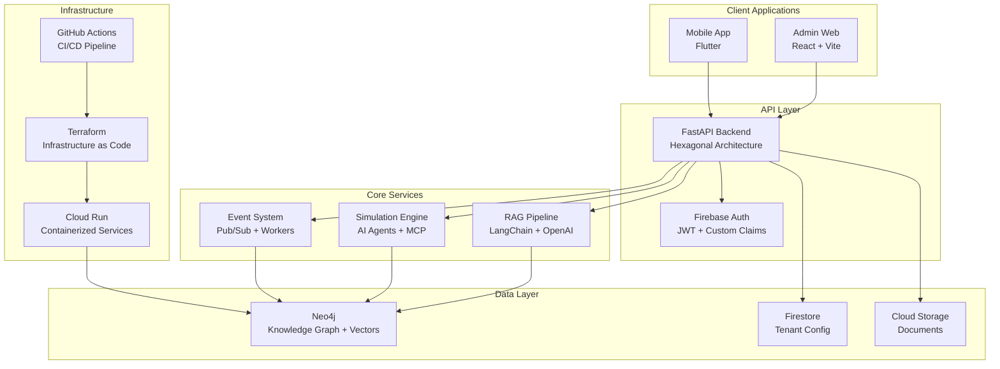

# ASCII Art and Illustrations Guide

## *Documentation of visual elements used in Living Twin monorepo markdown files*

## Overview

The Living Twin documentation uses various ASCII art and illustration techniques to enhance readability and provide visual structure. This guide catalogs the patterns and styles used throughout the project.

## 1. Architecture Diagrams

### **System Architecture (README.md)**

```bash
                          +--------------------+
                          |   React Admin UI   |
                          |  Vite @ :5173      |
                          +---------+----------+
                                    |
                                    | HTTP (JSON)
                                    v
+---------------------+     +-------+--------+       Bolt (7687)
|  Optional Frontend  |     |   FastAPI RAG  |  <--------------------+
|  (Flutter mobile)   | --> |  http://:8080  |                       |
+---------------------+     |  - Ingest      |                       |
             ^              |  - /query      |                       |
             |              |  - /debug/rag  |                       |
             |              +-------+--------+                       |
             |                      |                                |
             |                      | Vector search (Neo4j index)    |
             |                      v                                |
             |              +-------+--------+                       |
             |              |     Neo4j      |  ---------------------+
             |              |  :7474 / :7687 |   HAS_CHUNK edges
             |              |  Doc.embedding |   Source(title, url, tags, tenantId)
             |              +----------------+
```

**Style Elements:**

- **Boxes**: `+----+` for corners, `|` for vertical lines, `-` for horizontal lines
- **Arrows**: `-->`, `<--`, `v`, `^` for directional flow
- **Connections**: Lines connecting components with labels
- **Ports/URLs**: Embedded within boxes (`:5173`, `:8080`, `:7474`)

## 2. Directory Structure Trees

### **File System Layouts**

```bash
apps/api/app/
├── main.py                 # FastAPI application entry point
├── config.py              # Environment configuration
├── di.py                  # Dependency injection container
├── domain/                # Pure business logic
│   ├── models.py          # Domain entities
│   ├── services.py        # Business use cases
│   └── events.py          # Domain events
├── ports/                 # Abstract interfaces
│   ├── vector_store.py    # Vector search interface
│   ├── graph_store.py     # Graph database interface
│   ├── llm.py            # LLM provider interface
│   └── authz.py          # Authorization interface
├── adapters/              # Concrete implementations
│   ├── neo4j_store.py     # Neo4j implementation
│   ├── openai_llm.py      # OpenAI integration
│   ├── firebase_auth.py   # Firebase authentication
│   ├── firestore_repo.py  # Firestore operations
│   └── pubsub_bus.py      # Event publishing
└── routers/               # HTTP endpoints
    ├── rag.py             # RAG endpoints
    └── health.py          # Health checks
```

**Style Elements:**

- **Tree Structure**: `├──`, `└──`, `│` for hierarchical display
- **File Types**: `.py`, `.md`, `.json` extensions shown
- **Comments**: `# Description` for each file/directory
- **Indentation**: Consistent spacing for hierarchy levels

### **Simple Directory Lists**

```bash
local_data/
├── organizations.json   # Organization metadata
├── tenants.json        # Tenant settings (maps to orgs)
├── users.json          # User accounts by tenant
└── invitations.json    # Invitation codes
```

## 3. Data Flow Diagrams

### **Authentication Flow**

```bash
User signs in with john@acme.com
↓
System detects acme.com → Acme Corporation
↓
User automatically bound to organization
↓
Access to organization features & data
```

**Style Elements:**

- **Flow Direction**: `↓` for downward flow
- **Process Steps**: Plain text descriptions
- **Decision Points**: `→` for transitions
- **Email Examples**: `john@acme.com` for concrete examples

## 4. Tables and Matrices

### **Comparison Tables**

```markdown
| Feature | Development (Mock) | Production |
|---------|-------------------|------------|
| **Organizations** | JSON files | Firestore |
| **Users** | JSON files | Firestore + Firebase Auth |
| **Knowledge Graph** | Local Neo4j | Cloud Neo4j |
| **Authentication** | Mock/bypass | Firebase Auth + JWT |
| **Data Isolation** | File-based | Firestore security rules |
```

### **Status Tables**

```markdown
| Layer | Technology | Status | Notes |
|-------|------------|--------|-------|
| **Frontend Web** | React 18 + Vite + TypeScript | ✅ Production | Modern, fast development |
| **Frontend Mobile** | Flutter + Dart | 🔄 Foundation | Cross-platform native |
| **Backend API** | FastAPI + Python 3.11 | ✅ Production | High-performance async |
| **AI/ML** | LangChain + OpenAI + SBERT | ✅ Production | Hybrid cloud/local LLMs |
```

**Style Elements:**

- **Headers**: Pipe-separated `| Header |`
- **Separators**: `|-------|` for column divisions
- **Status Icons**: `✅` (complete), `🔄` (in progress), `❌` (not started)
- **Bold Text**: `**Text**` for emphasis
- **Technology Stacks**: Multiple technologies separated by `+`

### **Schema Mapping Tables**

```markdown
| Entity | Neo4j Label | Firestore Collection | Local Storage Key | Pub/Sub Topic |
|--------|-------------|---------------------|-------------------|---------------|
| Tenant | `:Tenant` | `tenants` | `tenant_data` | `tenant-events` |
| User | `:User` | `users` | `user_data` | `user-events` |
| Team | `:Team` | `teams` | `team_data` | `team-events` |
```

## 5. Security Scan Output

### **Vulnerability Tables**

```bash
┌─────────────────────────────────────┬──────────────────┬──────────┬───────────────────┬───────────────┬─────────────────────────────────────┐
│                Library              │    Vulnerability │ Severity │ Installed Version │ Fixed Version │                Title                │
├─────────────────────────────────────┼──────────────────┼──────────┼───────────────────┼───────────────┼─────────────────────────────────────┤
│ openssl                            │ CVE-2023-12345   │ CRITICAL │ 1.1.1f            │ 1.1.1g        │ OpenSSL buffer overflow             │
│ python3.11                         │ CVE-2023-67890   │ HIGH     │ 3.11.0            │ 3.11.1        │ Python arbitrary code execution     │
└─────────────────────────────────────┴──────────────────┴──────────┴───────────────────┴───────────────┴─────────────────────────────────────┘
```

**Style Elements:**

- **Box Drawing**: `┌┐└┘├┤┬┴┼─│` for table borders
- **Unicode Characters**: Extended ASCII for professional table appearance
- **Severity Levels**: `CRITICAL`, `HIGH`, `MEDIUM`, `LOW`
- **CVE References**: Standard vulnerability identifiers

## 6. Cost and Environment Tables

### **Cost Breakdown**

```markdown
| Environment | Min Cost/Month | When Idle | When Busy |
|-------------|----------------|-----------|-----------|
| **dev** | ~$0 | Scales to 0 | Scales up as needed |
| **staging** | ~$15-25 | 1 instance always running | Scales 1-10 |
| **prod** | ~$60-100 | 2 instances always running | Scales 2-50 |
```

## 7. Configuration Status

### **Component Status Matrix**

```markdown
| Component | Config File | Status | Key Paths |
|-----------|-------------|--------|-----------|
| API | `apps/api/pyproject.toml` | ✅ | Module structure |
| API | `docker/Dockerfile.api` | ✅ | `apps/api/` paths |
| Admin Web | `apps/admin_web/package.json` | ✅ | Dependencies |
| Admin Web | `apps/admin_web/vite.config.ts` | ✅ | Build config |
```

## 8. Troubleshooting Tables

### **Issue Resolution Matrix**

```markdown
| Issue | Fix |
|-------|-----|
| **`No such vector schema index: docEmbeddings`** | Run `make neo4j-init` |
| **Quota exceeded** from OpenAI | Enable Pay-as-you-go in OpenAI billing, or switch to LOCAL_EMBEDDINGS=1 |
| **pydantic-core build error** | Use Python 3.11 or 3.12 |
| **Auth error to Neo4j** | Reset volume: `docker compose down -v && make neo4j-up && make neo4j-init` |
| **Vectors dim mismatch** | Re-ingest docs after changing embedding model |
```

## 9. Plugin-Based Diagrams

### **Mermaid Architecture Diagrams (docs/ARCHITECTURE.md)**



**Style Elements:**

- **Subgraphs**: Logical grouping of related components
- **Node Labels**: Multi-line descriptions with technology stack
- **Directional Flow**: Clear arrows showing data/control flow
- **Hierarchical Layout**: Top-to-bottom architecture representation
- **Technology Annotations**: Specific technologies noted in node descriptions

## Design Principles

### **Consistency Guidelines**

1. **Box Drawing**: Use `+`, `-`, `|` for simple diagrams; `┌┐└┘├┤┬┴┼─│` for professional tables
2. **Arrows**: `-->`, `<--`, `↓`, `↑`, `→`, `←` for flow direction
3. **Status Icons**: `✅` (complete), `🔄` (in progress), `❌` (failed/not started), `⚠️` (warning)
4. **Emphasis**: `**Bold**` for important terms, `code` for technical elements
5. **Indentation**: Consistent 2-4 space indentation for hierarchy
6. **Comments**: `# Description` format for inline documentation

### **Visual Hierarchy**

1. **Architecture Diagrams**: Large, centered, with clear component boundaries
2. **Directory Trees**: Left-aligned with consistent branching characters
3. **Flow Diagrams**: Vertical flow with descriptive text at each step
4. **Tables**: Pipe-separated with clear headers and consistent column widths
5. **Code Blocks**: Triple backticks with language specification when applicable

### **Accessibility Considerations**

1. **Screen Readers**: All ASCII art includes descriptive text
2. **Monospace Fonts**: Assumes monospace font for proper alignment
3. **Character Compatibility**: Uses widely supported ASCII and Unicode characters
4. **Alternative Text**: Complex diagrams include text descriptions

## Usage Examples

### **Creating New Architecture Diagrams**

```bash
# Template for system components
+------------------+
|   Component      |
|   Port: :XXXX    |
+--------+---------+
         |
         | Protocol/Description
         v
+--------+---------+
|   Next Component |
+------------------+
```

### **Creating Directory Trees**

```bash
# Template for file structures
project_root/
├── folder1/
│   ├── file1.ext        # Description
│   └── file2.ext        # Description
├── folder2/
│   └── subfolder/
│       └── file3.ext    # Description
└── file4.ext            # Description
```

### **Creating Flow Diagrams**

```bash
# Template for process flows
Step 1: Initial action
↓
Step 2: Processing → Decision point
↓
Step 3: Final result
```

### **Creating Status Tables**

```markdown
# Template for status tracking
| Component | Status | Notes |
|-----------|--------|-------|
| **Item 1** | ✅ Complete | Working well |
| **Item 2** | 🔄 In Progress | 80% done |
| **Item 3** | ❌ Not Started | Planned for next sprint |
```

## Character Reference

### **Box Drawing Characters**

- **Simple**: `+` (corners), `-` (horizontal), `|` (vertical)
- **Unicode Light**: `┌┐└┘` (corners), `─` (horizontal), `│` (vertical), `├┤┬┴┼` (junctions)
- **Unicode Heavy**: `┏┓┗┛` (corners), `━` (horizontal), `┃` (vertical), `┣┫┳┻╋` (junctions)

### **Arrow Characters**

- **ASCII**: `-->`, `<--`, `^`, `v`
- **Unicode**: `→`, `←`, `↑`, `↓`, `↗`, `↘`, `↙`, `↖`

### **Status and Emoji Characters**

- **Status**: `✅` (check), `❌` (cross), `⚠️` (warning), `🔄` (progress)
- **Objects**: `📊` (chart), `🌐` (web), `💻` (computer), `📱` (mobile)
- **Actions**: `🚀` (deploy), `🔧` (tools), `🧪` (test), `🔍` (search)

### **Tree Drawing Characters**

- **Branches**: `├──` (middle), `└──` (last)
- **Vertical**: `│` (continuation)
- **Spacing**: 4 spaces for each level

## Best Practices

### **Readability**

1. **Consistent Spacing**: Maintain uniform spacing in diagrams
2. **Clear Labels**: Use descriptive labels for all components
3. **Logical Flow**: Arrange elements in logical reading order (top-to-bottom, left-to-right)
4. **Appropriate Scale**: Size diagrams appropriately for content complexity

### **Maintenance**

1. **Version Control**: ASCII art should be version controlled like code
2. **Documentation**: Include text descriptions for complex diagrams
3. **Testing**: Verify diagrams render correctly in different environments
4. **Updates**: Keep diagrams synchronized with code changes

### **Cross-Platform Compatibility**

1. **Character Support**: Test on different operating systems and terminals
2. **Font Requirements**: Document monospace font requirements
3. **Encoding**: Use UTF-8 encoding for Unicode characters
4. **Fallbacks**: Provide ASCII alternatives for complex Unicode diagrams

---

*This guide documents the ASCII art and illustration patterns used throughout the Living Twin monorepo documentation as of January 2025.*
