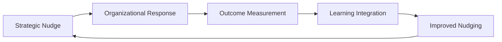

# Verifiable Rewards: The Learning Engine

> **Last Updated**: January 2025  
> **Status**: Core concept integrated into Living Twin architecture

## 🎯 **Overview**

**Verifiable Rewards** is the core mechanism that enables the Organizational Twin to learn from organizational responses and continuously evolve its decision support capabilities. It transforms the Twin from a static advisor into a living, learning strategic partner that becomes increasingly effective at guiding the organization.

## 🔄 **The Learning Cycle**

### **How Verifiable Rewards Work**

The Organizational Twin operates on a continuous learning cycle:

### **1. Strategic Nudging**
- The Twin suggests strategic directions through catchball dialog
- Uses role-based intelligence to tailor communication style
- Leverages organizational memory to apply learned patterns
- Escalates from nudge → recommendation → order based on response

### **2. Organizational Response**
- Teams and individuals respond to strategic guidance
- Response patterns are captured and analyzed
- Success metrics track alignment with strategic goals
- Feedback loops refine understanding of organizational dynamics

### **3. Outcome Measurement**
- Tracks how well responses align with strategic objectives
- Measures the effectiveness of different communication approaches
- Validates the impact of strategic guidance on organizational outcomes
- Identifies patterns in successful vs. unsuccessful interventions

### **4. Learning Integration**
- Incorporates learnings into the Twin's decision-making algorithms
- Updates organizational memory with proven approaches
- Refines communication templates based on success patterns
- Adapts escalation logic based on response effectiveness

### **5. Improved Nudging**
- Applies learned patterns to future strategic guidance
- Uses proven communication styles for different teams
- Leverages organizational memory for better context
- Continuously improves the effectiveness of strategic interventions

## 🧠 **Wisdom of the Crowd Integration**

### **Catchball Dialog Enhancement**

Verifiable Rewards leverages the collective intelligence of the organization:

- **Two-way Conversations**: Strategy is refined through organizational feedback
- **Response Pattern Analysis**: The Twin learns which approaches work best
- **Success Metric Validation**: Measurable outcomes validate strategic guidance
- **Adaptive Learning**: The system continuously improves its capabilities

### **Organizational Memory**

The Twin builds a comprehensive memory of what works:

- **Communication Styles**: Which approaches resonate with different teams
- **Timing Patterns**: When strategic nudges are most effective
- **Escalation Triggers**: What prompts successful organizational response
- **Success Factors**: Key elements that drive strategic alignment

## 📊 **Measurement Framework**

### **Primary Metrics**

- **Verifiable Rewards Effectiveness**: How much the Twin's learning improves outcomes over time
- **Catchball Dialog Quality**: Success rate of strategic conversations and their impact
- **Organizational Learning Velocity**: Speed at which the Twin adapts its approach
- **Strategic Alignment Improvement**: Measurable enhancement in goal alignment

### **Secondary Metrics**

- **Response Pattern Recognition**: How quickly the Twin identifies successful approaches
- **Communication Style Adaptation**: Rate of improvement in tailored messaging
- **Escalation Effectiveness**: Success rate of communication escalation
- **Organizational Memory Utilization**: How effectively learned patterns are applied

## 🎯 **Benefits of Verifiable Rewards**

### **For the Organization**

- **Smarter Strategic Guidance**: The Twin becomes increasingly effective at nudging in the right direction
- **Better Alignment**: Improved understanding of what drives organizational response
- **Faster Adaptation**: Quicker course corrections based on proven patterns
- **Reduced Strategic Drift**: More effective maintenance of strategic focus

### **For the Twin**

- **Continuous Evolution**: The system becomes smarter over time
- **Proven Effectiveness**: Measurable outcomes validate strategic guidance
- **Organizational Memory**: Remembers what works and what doesn't
- **Adaptive Intelligence**: Learns from organizational dynamics

### **For Leadership**

- **Data-Driven Insights**: Evidence-based understanding of what drives alignment
- **Proven Approaches**: Access to strategies that have been validated through outcomes
- **Continuous Improvement**: The system gets better at supporting strategic goals
- **Reduced Uncertainty**: More confidence in strategic interventions

## 🏗️ **Technical Implementation**

### **Learning Algorithms**

- **Response Pattern Analysis**: Machine learning models that identify successful approaches
- **Communication Style Optimization**: AI that adapts messaging based on effectiveness
- **Escalation Logic Refinement**: Dynamic adjustment of escalation triggers
- **Organizational Memory Management**: Intelligent storage and retrieval of learned patterns

### **Data Collection**

- **Response Tracking**: Comprehensive monitoring of organizational responses
- **Outcome Measurement**: Systematic tracking of strategic alignment improvements
- **Pattern Recognition**: AI-powered identification of successful approaches
- **Feedback Integration**: Continuous incorporation of learnings into the system

### **Integration Points**

- **Intelligence Hub**: Learning algorithms integrated with strategic intelligence
- **Communication Queue**: Adaptive escalation based on learned patterns
- **Organizational Memory**: Persistent storage of proven approaches
- **Catchball Dialog**: Enhanced conversations using learned communication styles

## 🚀 **Future Enhancements**

### **Advanced Learning Capabilities**

- **Predictive Modeling**: Anticipate organizational responses before they happen
- **Personalized Approaches**: Tailor communication to individual team dynamics
- **Scenario Planning**: Use learned patterns to predict strategic outcomes
- **Automated Optimization**: Self-improving algorithms that continuously enhance effectiveness

### **Enhanced Measurement**

- **Real-time Analytics**: Live tracking of learning effectiveness
- **Predictive Metrics**: Forecast future strategic alignment improvements
- **Comparative Analysis**: Benchmark against industry best practices
- **Impact Attribution**: Clear connection between learning and outcomes

## 📈 **Success Stories**

### **Case Study: Strategic Alignment Improvement**

**Challenge**: A mid-size technology company struggled with strategic drift, with only 60% of teams aligned with strategic goals.

**Verifiable Rewards Implementation**:
- The Twin began tracking response patterns to strategic nudges
- Identified that engineering teams responded best to data-driven insights
- Marketing teams preferred narrative-based strategic guidance
- Sales teams needed competitive context for strategic alignment

**Results**:
- Strategic alignment improved to 85% within 6 months
- The Twin's effectiveness at strategic guidance improved by 40%
- Response time to strategic changes decreased by 60%
- Leadership confidence in strategic interventions increased significantly

### **Key Learnings**

- **Data-Driven Insights**: Engineering teams responded 3x better to quantitative strategic guidance
- **Narrative Approach**: Marketing teams showed 2.5x improvement with story-based strategic communication
- **Competitive Context**: Sales teams required market positioning context for strategic alignment
- **Timing Matters**: Strategic nudges were 2x more effective when delivered during planning cycles

## 🎯 **Getting Started with Verifiable Rewards**

### **Phase 1: Foundation**

- Implement response tracking and outcome measurement
- Establish baseline metrics for strategic alignment
- Begin collecting organizational response patterns
- Set up learning algorithm infrastructure

### **Phase 2: Learning Integration**

- Integrate learning algorithms with strategic intelligence
- Implement organizational memory management
- Begin adaptive communication style optimization
- Establish feedback loops for continuous improvement

### **Phase 3: Advanced Capabilities**

- Deploy predictive modeling for organizational responses
- Implement personalized strategic guidance approaches
- Add scenario planning based on learned patterns
- Establish automated optimization systems

## 🔍 **Monitoring and Optimization**

### **Key Performance Indicators**

- **Learning Rate**: How quickly the Twin improves its effectiveness
- **Pattern Recognition**: Speed of identifying successful approaches
- **Adaptation Velocity**: Rate of applying learned patterns
- **Outcome Improvement**: Measurable enhancement in strategic alignment

### **Optimization Strategies**

- **Continuous Monitoring**: Real-time tracking of learning effectiveness
- **A/B Testing**: Systematic testing of different approaches
- **Feedback Integration**: Rapid incorporation of learnings
- **Performance Tuning**: Regular optimization of learning algorithms

## 🎯 **Conclusion**

Verifiable Rewards transforms the Organizational Twin from a static advisor into a living, learning strategic partner. By continuously learning from organizational responses and evolving its decision support capabilities, the Twin becomes increasingly effective at guiding the organization toward strategic alignment.

The key to success is establishing robust measurement frameworks, implementing effective learning algorithms, and creating feedback loops that enable continuous improvement. With Verifiable Rewards, the Organizational Twin doesn't just provide strategic guidance—it learns, adapts, and becomes an increasingly valuable strategic partner for the organization.
