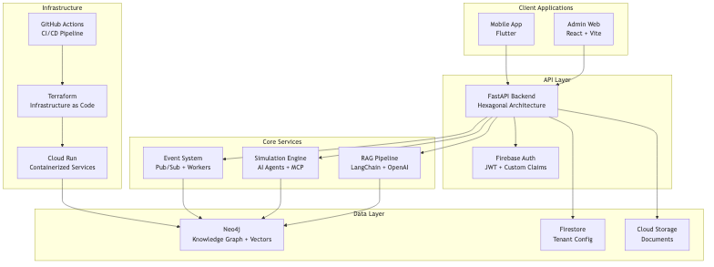

<!-- _class: title-page -->

# **Living Twin**
## System Overview

August 16, 2025

---

## System Overview

Living Twin is an AI-powered organizational intelligence platform that combines **Retrieval-Augmented Generation (RAG)**, **knowledge graphs**, and **organizational simulation** to provide insights into team dynamics, goal alignment, and communication patterns.

---

## Core Value Proposition

- **Knowledge Management**: RAG-powered search across organizational documents and communications
- **Organizational Simulation**: AI agents that model employee behavior and predict organizational outcomes
- **Multi-tenant SaaS**: Secure, scalable platform supporting multiple organizations
- **Real-time Insights**: Live dashboards showing team pulse, goal progress, and communication patterns

---

## High-Level Architecture

---

## Core Components: Backend API

**Technology**: FastAPI with Hexagonal Architecture (Ports & Adapters)

- **Clean Architecture**: Hexagonal pattern with clear separation of concerns
- **Dependency Injection**: Centralized DI container for testability
- **Multi-tenant**: Tenant isolation at data and API level
- **Event-driven**: Pub/Sub integration for async processing
- **Extensible**: Plugin-ready architecture via ports/adapters

---

## Core Components: Organizational Simulation Engine

**Technology**: Python with AI agent framework + MCP integration

- **AI Agents**: Realistic employee behavior simulation using LLMs
- **Personality Modeling**: 6-trait personality system
- **Organizational Dynamics**: Manager-report relationships, department interactions
- **Predictive Analytics**: Forecast organizational outcomes based on policy changes

---

## Autonomous AI Agents with MCP

The system can be extended with independent AI agents running as MCP (Model Context Protocol) servers.

- **Monitor Competition**: Track competitor activities and market changes.
- **Analyze Trend Data**: Ingest and analyze data from reliable sources to identify trends.
- **Influence Decisions**: Provide real-time insights to influence the decision-making process within the simulation.

---

## Core Components: RAG Pipeline

**Technology**: LangChain + OpenAI/Local embeddings + Neo4j vectors

- **Document Ingestion**: PDF/DOCX parsing with metadata extraction
- **Embedding Generation**: OpenAI embeddings + local SBERT fallback
- **Vector Storage**: Neo4j native vector indexes
- **Retrieval**: Semantic search with relevance scoring
- **Generation**: Context-aware responses using GPT-4/local LLMs

---

## The Power of Context: Document Ingestion

The real value of the system comes from its ability to understand the unique context of your organization.

- **Ingest Business Documents**: The system ingests a wide range of business documents, from reports and presentations to emails and chat logs.
- **Build a Knowledge Graph**: This information is used to build a comprehensive knowledge graph of your organization.
- **Provide Context-aware Insights**: The AI can then provide highly relevant and context-aware insights, recommendations, and answers.

---

## Hybrid LLM Architecture

The system offers a flexible, hybrid approach to Large Language Models (LLMs).

- **Local RAG Server**: Run your own RAG server with locally-hosted models for maximum data privacy and control.
- **Model Selection**: Choose from a variety of open-source and proprietary models to best suit your needs.
- **LLM Routers**: Access multiple LLMs through a single interface, with intelligent routing to the best model for each task.
- **Cloud & Local Flexibility**: Seamlessly switch between cloud-based LLMs (like OpenAI) and local models.

---

## Core Components: Data Architecture

- **Neo4j**: Primary Knowledge Graph with native vector indexes for semantic search.
- **Firestore**: Configuration & State management for tenants and users.
- **Cloud Storage**: Original document repository with tenant-isolated buckets.

---

## Technology Stack Summary

| Layer | Technology |
|---|---|
| **Frontend Web** | React 18 + Vite + TypeScript |
| **Frontend Mobile** | Flutter + Dart |
| **Backend API** | FastAPI + Python 3.11 + uv |
| **AI/ML** | LangChain + OpenAI + SBERT |
| **Database** | Neo4j + Firestore |
| **Infrastructure** | GCP + Terraform |
| **CI/CD** | GitHub Actions |

---

## Conclusion

- **AI-powered organizational simulation**
- **Hybrid LLM approach** for cost-effectiveness
- **Graph-native knowledge management**
- **Developer-first architecture**
- **Enterprise-grade security**
